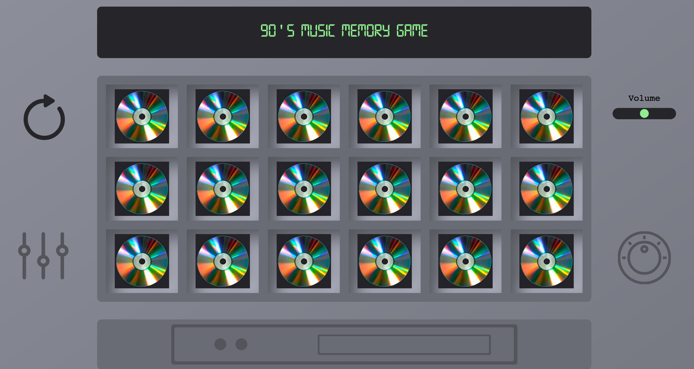

# 90s Music Memory Game

## Sections
* [Description](#Description)
* [How to use](#How)
* [Technologies](#Technologies)
* [Contributions](#Contributions)

## Description

This is an old trusty memory game with a UI simulating a 1990s sound system. The main purpose of building it  was learning about animating and displaying layouts with CSS and controlling audio with Javascript. 
It will only be showcased to potential employers and all the songs on it are cut and belong to their owners.

## How to use

Its only prerequirement is to have a browser. The deployment can be seen [here](https://github.com/ceciCoding/90s-Music-Memory-Game).  
The playing flow is finding matches between two albums. When a match occurs a song of the correspondent album will play until another album is clicked.  
There is a reset button to the left that restarts the game and a volume handler to the right. 

## Technologies

* [Javascript](https://github.com/ceciCoding/90s-Music-Memory-Game/blob/master/script.js)
* [CSS](https://github.com/ceciCoding/90s-Music-Memory-Game/tree/master/CSS)

## Contributions

Contributions are welcome in the form of pull requests 🦄

